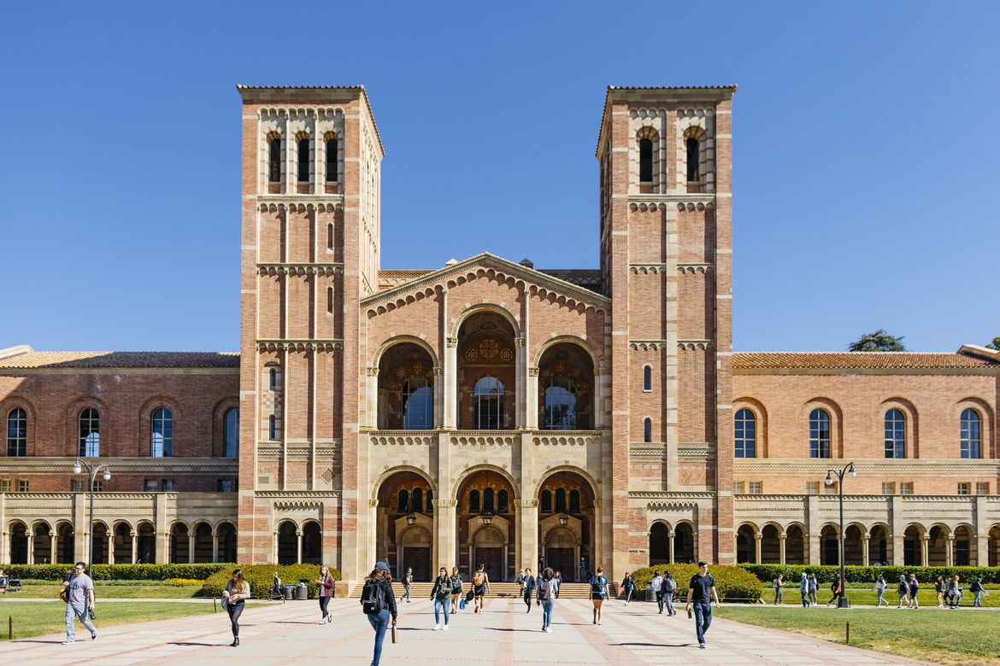
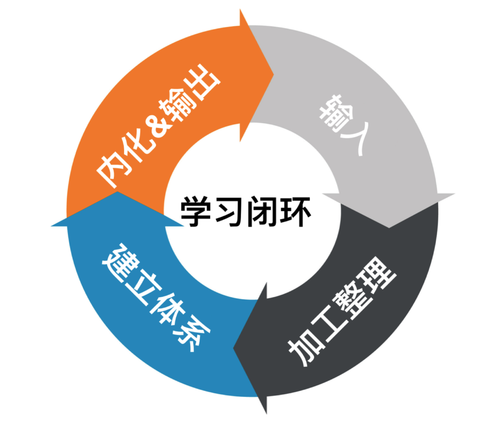
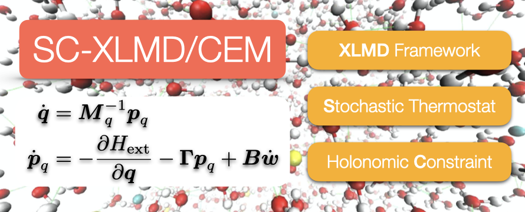
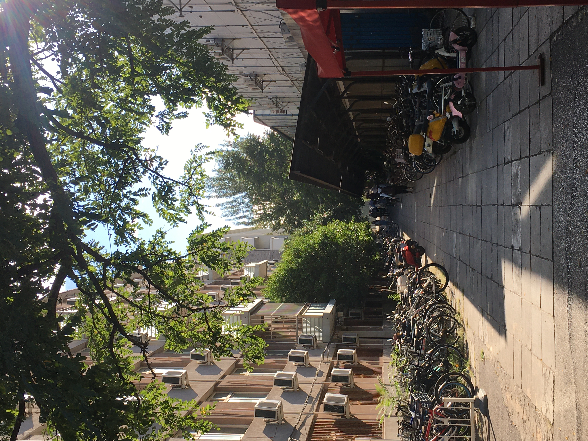

# 怎么讲？

. . .

## 四个故事，四点思考

比做了什么更重要的是：我们为什么去做。

# 一、关于视野

## UCLA 访学

## 教学体制对比思考

- 教学资源的可用性
- 自主学习

# 二、关于知识

## 学习闭环

{ width=60% height=60% }

## 让学习卓有成效

在大三学年中：

::: incremental

- 12 万字个人维基百科
- 45 篇文章
- 共修习 40 学分，学年平均成绩 3.93
- 一阶导数 0.05，二阶导数 0.04

:::

# 三、关于创造

## 研究论文发表

## 曲折上升，精益求精

- 既要脚踏实地每日做工
- 也要从更高的视角不断反思改进

# 四、关于生活

## 大四和大一

{ width=40% height=70% }

## 唯物史观

不必留恋所谓过去的好时光，那个时候生活一样充满艰险和迷茫；

也不必为今天过分失望，因为今天也总有一天会被人们称做是——过去的好时光。
